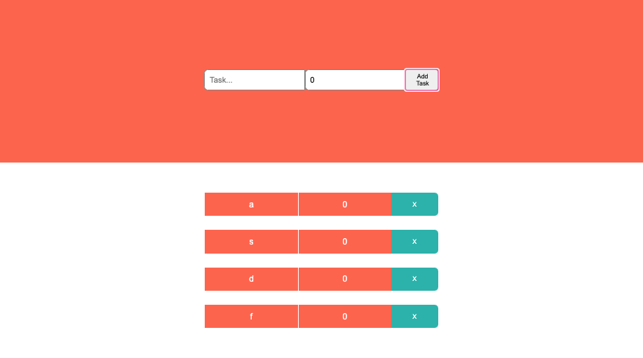

# PedroTech-ReactJSTSTodolistApp-20210310

> Pedro Tech - Todo List in ReactJS using TypeScript Tutorial (Mar 10, 2021)

Link: https://www.youtube.com/watch?v=bjnW2NLAofI&list=PLpPqplz6dKxVEqex8RMhgZUUe5_Sc6QHa&index=19

**Description**
> My other TypeScript Video: https://youtu.be/-w1i-gARuJs

> In this video I will teach you guys how to code a todo list in react using typescript. We use the typescript template to generate the application.
> 
Code: https://github.com/machadop1407/TodoList-React-TypeScript

Playlist: https://www.youtube.com/playlist list=PLpPqplz6dKxVEqex8RMhgZUUe5_Sc6QHa

🚀 Learn ReactJS By Building 6 Projects: https://codedamn.com/learn/reactjs-pr...

---


> TABLE OF CONTENTS
- [PedroTech-ReactJSTSTodolistApp-20210310](#pedrotech-reactjststodolistapp-20210310)
- [Project Setup](#project-setup)
  - [Setup](#setup)
  - [Delete Uneeded Files and Clean Up Code](#delete-uneeded-files-and-clean-up-code)
- [Important Stuff from the Course](#important-stuff-from-the-course)
- [Getting Started with Create React App](#getting-started-with-create-react-app)
  - [Available Scripts](#available-scripts)
    - [`yarn start`](#yarn-start)
    - [`yarn test`](#yarn-test)
    - [`yarn build`](#yarn-build)
    - [`yarn eject`](#yarn-eject)
  - [Learn More](#learn-more)

---
# Project Setup
## Setup

```tsx
yarn create react-app pedrotech-reactjststodolistapp-20210310 --template typescript

cd pedrotech-reactjststodolistapp-20210310 && yarn start
```

## Delete Uneeded Files and Clean Up Code

- App.test.tsx
- index.css
- logo.svg
- setupTest.sts

# Important Stuff from the Course
App.tsx
```tsx
// START: IMPORTS
import React, { useState } from "react";
import "./App.css";

// Start: Import Interfaces
import { ITask } from "./Interfaces";
// End: Import Interfaces

// Start: Import Components
import TodoTask from "./components/TodoTask";
// End: Import Components
// END: IMPORTS

// START: COMPONENT
const App: React.FC = () => {
  // Start: States
  const [task, setTask] = useState<string>("");
  const [deadline, setDeadline] = useState<number>(0);
  const [todoList, setTodoList] = useState<ITask[]>([]);
  // End: States

  // Start: Methods
  /**
   * @name handleChange()
   * @param event
   */
  const handleChange = (event: React.ChangeEvent<HTMLInputElement>): void => {
    if (event.target.name === "task") {
      setTask(event.target.value);
    } else {
      setDeadline(Number(event.target.value));
    }
  };

  /**
   * @name addTask()
   */
  const addTask = (): void => {
    const newTask = { taskName: task, deadline: deadline };
    setTodoList([...todoList, newTask]);

    setTask("");
    setDeadline(0);
  };

  /**
   * @name completeTask()
   * @param taskNameToDelete
   */
  const completeTask = (taskNameToDelete: string) => {
    setTodoList(
      todoList.filter((task) => {
        return task.taskName !== taskNameToDelete;
      })
    );
  };
  // End: Methods

  // Start: Inner Components
  const listTodosComponent = todoList.map((task: ITask, key: number) => {
    return <TodoTask key={key} task={task} completeTask={completeTask} />;
  });
  // End: Inner Components

  // Start: Template
  return (
    <div className="App">
      {/* Start: Header */}
      <div className="header">
        <input
          type="text"
          placeholder="Task..."
          value={task}
          name="task"
          onChange={handleChange}
        />
        <input
          type="number"
          name="deadline"
          value={deadline}
          placeholder="Deadline (in Days)..."
          onChange={handleChange}
        />
        <button onClick={addTask}>Add Task</button>
      </div>
      {/* End: Header */}

      {/* Start: Todo List */}
      <div className="todoList">{listTodosComponent}</div>
      {/* End: Todo List */}
    </div>
  );
  // End: Template
};
// END: COMPONENT

export default App;
```

components/TodoTask

```tsx
import React from "react";
import { ITask } from "../Interfaces";

interface Props {
  task: ITask;
  completeTask(taskNameToDelete: string): void;
}

const TodoTask = ({ task, completeTask }: Props) => {
  return (
    <div className="task">
      <div className="content">
        <span>{task.taskName}</span>
        <span>{task.deadline}</span>
      </div>
      <button onClick={() => completeTask(task.taskName)}>X</button>
    </div>
  );
};

export default TodoTask;
```

Interfaces.ts

```tsx
export interface ITask{
  taskName:string,
  deadline:number
}
```
---
# Getting Started with Create React App

This project was bootstrapped with [Create React App](https://github.com/facebook/create-react-app).

## Available Scripts

In the project directory, you can run:

### `yarn start`

Runs the app in the development mode.\
Open [http://localhost:3000](http://localhost:3000) to view it in the browser.

The page will reload if you make edits.\
You will also see any lint errors in the console.

### `yarn test`

Launches the test runner in the interactive watch mode.\
See the section about [running tests](https://facebook.github.io/create-react-app/docs/running-tests) for more information.

### `yarn build`

Builds the app for production to the `build` folder.\
It correctly bundles React in production mode and optimizes the build for the best performance.

The build is minified and the filenames include the hashes.\
Your app is ready to be deployed!

See the section about [deployment](https://facebook.github.io/create-react-app/docs/deployment) for more information.

### `yarn eject`

**Note: this is a one-way operation. Once you `eject`, you can’t go back!**

If you aren’t satisfied with the build tool and configuration choices, you can `eject` at any time. This command will remove the single build dependency from your project.

Instead, it will copy all the configuration files and the transitive dependencies (webpack, Babel, ESLint, etc) right into your project so you have full control over them. All of the commands except `eject` will still work, but they will point to the copied scripts so you can tweak them. At this point you’re on your own.

You don’t have to ever use `eject`. The curated feature set is suitable for small and middle deployments, and you shouldn’t feel obligated to use this feature. However we understand that this tool wouldn’t be useful if you couldn’t customize it when you are ready for it.

## Learn More

You can learn more in the [Create React App documentation](https://facebook.github.io/create-react-app/docs/getting-started).

To learn React, check out the [React documentation](https://reactjs.org/).
